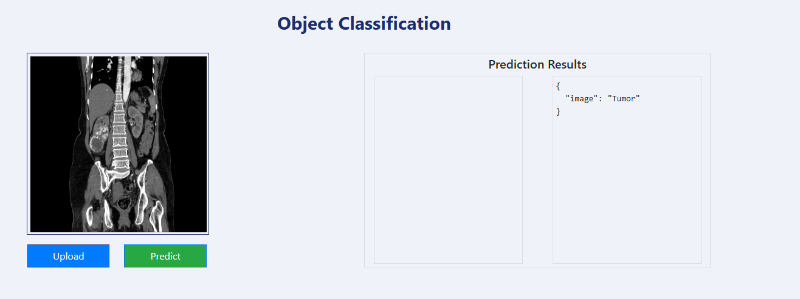
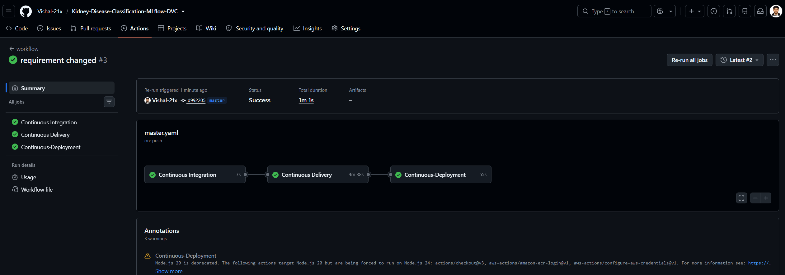
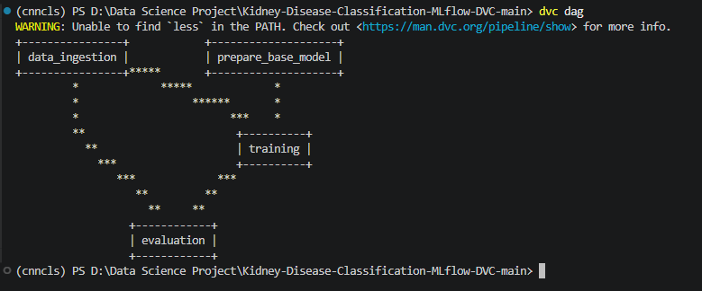

# 🏥 Kidney Disease Classification - MLflow & DVC

**A production-ready deep learning pipeline for classifying kidney CT scan images with automated CI/CD deployment on AWS**

<div align="center">

## ✨ Key Features

## 📸 Project in Action

### Live Product in Action

<div align="center">



*Flask web app with real-time kidney disease classification on CT scans*

</div>

### Automated Deployment Pipeline

<div align="center">



*Continuous Integration, Delivery, and Deployment - Every push to master auto-deploys to production*

</div>

### ML Pipeline Orchestration

<div align="center">



*Reproducible data science workflow - Data Ingestion → Base Model → Training → Evaluation*

</div>

</div>
---

## 🎯 Overview

This project implements an **end-to-end machine learning pipeline** for kidney disease classification from CT scan images. It demonstrates professional ML engineering with production-grade DevOps, automated deployment, and experiment tracking.

**Classifies 4 kidney conditions:**
- 🔴 **Tumor** - Malignant kidney tumors
- 🟡 **Stone** - Kidney stones  
- 🟢 **Normal** - Healthy kidneys
- 🔵 **Cyst** - Kidney cysts

---

## ✨ Key Features

### 🤖 Machine Learning
- Pre-trained **VGG16** model with transfer learning
- Data augmentation for improved generalization
- 4-class image classification from CT scans
- Real-time experiment tracking with MLflow

### 📊 Data & Experiment Management
- **DVC Pipeline** - Reproducible data processing workflows
- **Experiment Versioning** - Track parameters, metrics, and models
- **Data Versioning** - Version control for datasets
- **Automated Orchestration** - DAG-based pipeline execution

### 🔄 CI/CD & Production Deployment
- **GitHub Actions** - Automated build, test, and deploy
- **Docker** - Containerized application for reproducibility
- **AWS ECR** - Elastic Container Registry for Docker images
- **AWS EC2** - Auto-deployment on push to master branch
- **Production Ready** - Self-hosted GitHub Actions runner

### 🌐 Web Application
- **Flask REST API** - Real-time prediction inference
- **User-Friendly Interface** - Simple image upload & results
- **Error Handling** - Robust error management

---

## 🏗️ Architecture

### Machine Learning Pipeline
```
Raw Data → Data Prep → Model Train → Evaluation → Production
    ↓          ↓           ↓            ↓             ↓
   DVC        DVC       MLflow       MLflow       Docker
  Track     Version     Logging     Artifacts     Package
```

### CI/CD Deployment Flow
```
GitHub Push → GitHub Actions → Docker Build → AWS ECR → EC2 Deploy
                   ↓               ↓            ↓         ↓
            Lint & Test      Build Image    Push Image  Run
                                                        Container
```

### AWS Production Architecture
```
┌─────────────────────────────────────────────────────┐
│              GitHub Repository                       │
│          (Code + GitHub Actions Workflow)            │
└──────────────────────┬──────────────────────────────┘
                       │ Push to Master
                       ▼
        ┌──────────────────────────┐
        │  GitHub Actions          │
        │  - Build Docker Image    │
        │  - Push to ECR           │
        └──────────────┬───────────┘
                       │
                       ▼
        ┌──────────────────────────┐
        │  AWS ECR                 │
        │  Container Registry      │
        └──────────────┬───────────┘
                       │
                       ▼
        ┌──────────────────────────┐
        │  AWS EC2 Instance        │
        │  (Self-hosted Runner)    │
        │                          │
        │  - Pull Latest Image     │
        │  - Stop Old Container    │
        │  - Run New Container     │
        │  - Port: 8080            │
        └──────────────────────────┘
```

---

## 📁 Project Structure

```
Kidney-Disease-Classification-MLflow-DVC/
├── .github/workflows/
│   └── master.yaml                  # CI/CD Pipeline
├── src/cnnClassifier/
│   ├── components/                  # ML Components
│   │   ├── data_ingestion.py
│   │   ├── prepare_base_model.py
│   │   ├── model_training.py
│   │   └── model_evaluation.py
│   ├── config/
│   │   └── configuration.py
│   ├── pipeline/                    # ML Pipeline Stages
│   │   ├── stage_01_data_ingestion.py
│   │   ├── stage_02_prepare_base_model.py
│   │   ├── stage_03_model_training.py
│   │   └── stage_04_model_evaluation.py
│   └── utils/
│       └── common.py
├── research/                        # Jupyter Notebooks
│   ├── 01_data_ingestion.ipynb
│   ├── 02_prepare_base_model.ipynb
│   ├── 03_model_training.ipynb
│   └── 04_model_evaluation.ipynb
├── config/
│   └── config.yaml                  # Configuration
├── params.yaml                      # Pipeline Parameters
├── dvc.yaml                         # DVC Pipeline Definition
├── Dockerfile                       # Docker Containerization
├── app.py                           # Flask Web Application
├── main.py                          # Pipeline Orchestration
├── requirements.txt                 # Dependencies
└── setup.py                         # Package Setup
```

---

## 📊 Model Performance

### Training Results
- **Model**: VGG16 with transfer learning
- **Dataset**: 2,487 training images, 9,959 validation images
- **Classes**: 4 (Tumor, Stone, Normal, Cyst)
- **Image Size**: 224x224x3
- **Framework**: TensorFlow 2.12

### Metrics Tracked
- Training Loss & Validation Accuracy
- Per-class Precision/Recall/F1-Score
- Training Duration & Resource Usage
- Model Checkpoints & Best Weights

All metrics monitored via **MLflow Dashboard** for experiment comparison and analysis.

---

## 📝 Project Highlights

✨ **What Makes This Project Stand Out:**

1. **End-to-End Implementation** - From raw data to production deployment
2. **Professional DevOps** - CI/CD pipeline with GitHub Actions
3. **Experiment Management** - MLflow for comprehensive experiment tracking
4. **Data Versioning** - DVC for reproducible data pipelines
5. **Scalable Architecture** - Modular, maintainable, production-grade code
6. **Production Ready** - Error handling, logging, monitoring capabilities
7. **Cloud Native** - Deployed on AWS EC2 with auto-scaling
8. **Automated Deployment** - Push → Build → Test → Deploy pipeline
9. **Web Interface** - Flask REST API for easy integration
10. **Industry Best Practices** - Docker, containerization, version control


## 🛠️ Tech Stack & Skills


**Machine Learning & Deep Learning**
Python • TensorFlow • Keras • NumPy • Pandas • Scikit-learn

**ML Operations & Tracking**
MLflow • DVC

**Web Framework & API**
Flask • Jupyter

**DevOps & Cloud**
Docker • GitHub Actions • AWS • AWS EC2 • AWS ECR

**Version Control & Collaboration**
Git • GitHub

**Environment & Package Management**
Conda • Pip

---

<div align="center">

**A demonstration of professional ML engineering from research to production**


</div>